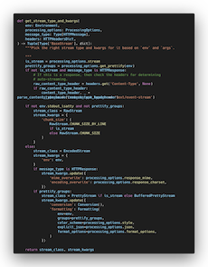
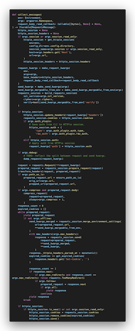

# Code Limit

Your Refactoring Alarm 🔔

<div align="center">

[](https://github.com/getcodelimit/codelimit/actions/workflows/main.yml)
[](https://codecov.io/gh/getcodelimit/codelimit)
[](https://mypy-lang.org/)
[](https://github.com/psf/black)
[](https://github.com/astral-sh/ruff)
[](https://gitmoji.dev)
[](https://github.com/getcodelimit/codelimit)

</div>

# Introduction

Code Limit is a tool for developers with one goal: _it tells the developer when
it’s time to refactor_.

Code Limit measures the lines of code for each function in your codebase and
assigns each function to a category:

<div align="center">

| Easy | Verbose | Hard-to-maintain | Unmaintainable |
| :---: | :---: | :---: | :---: |
| 1 - 15 lines of code | 16 - 30 lines of code | 31 - 60 lines of code | 60+ lines of code |
|  |  |  |  |

</div>

As the table above shows, functions with more than 60 lines of code (comments
and empty lines are not counted) are _unmaintainable_, and _need_ to be
refactored. Functions with more than 30 lines of code run a risk of turning
into unmaintainable functions over time, you should keep an eye on them and
refactor if possible. Functions in the first two categories are fine and don't
need refactoring.

Function length is just one code metric, but it is a very important code
metric. Short functions are easy to understand, easy to test, easy to re-use.
For example, code duplication is another important code metric but duplication
is much easier to prevent and fix if your functions are short.

Function length is a simple code metric, so simple you can count it by hand.
Because it's such a simple metric, it's also a (fairly) non-controversial
metric. Most developers agree longer functions are harder to maintain. Also,
there's always a refactoring possible to make functions smaller.

Because function length is such a simple code metric, many code quality tools
measure it. But these tools measure a lot more metrics, sometimes so much
metrics that developers are overwhemled and loose focus on the most important
metric: function length.

Code Limit measures one metric: function length. Code Limit tries to be the
best developer tool for measuring function length. By notifying developers when
it's time to refactor, Code Limit prevents unmaintainable code.

Let's keep your software maintainable and prevent it from becoming legacy
code. Start using Code Limit today!

# Quickstart

## Pre-commit hook

Code Limit can be installed as a [pre-commit](https://pre-commit.com/) hook so
it alarms you during development when it's time to refactor:

```yaml
-   repo: https://github.com/getcodelimit/codelimit
    rev: 0.6.2
    hooks:
    - id: codelimit
```

Code Limit is intended to be used alongside formatting, linters and other hooks
that improve the consistency and quality of your code (such as
[Black](https://github.com/psf/black),
[Ruff](https://github.com/astral-sh/ruff) and
[MyPy](https://github.com/python/mypy).) As an example pre-commit configuration
see the
[`pre-commit-config.yaml`](https://github.com/getcodelimit/codelimit/blob/main/.pre-commit-config.yaml)
from Code Limit itself.

When running as a hook, Code Limit *warns* about functions that *should* be
refactored and *fails* for functions that *need* to be refactord.

To show your project uses Code Limit place this badge in the README markdown:
```
](https://github.com/getcodelimit/codelimit)
```

## GitHub Actions

Code Limit is available as a GitHub Action

To run Code Limit on every push and before every merge to `main`, append it to
your GH Actions workflow:

```yaml
name: 'main'
on:
  push:
    branches: main
  pull_request:
    branches: main
jobs:
  ci:
    runs-on: ubuntu-latest
    steps:
      - name: 'Checkout'
        uses: actions/checkout@v2
      - name: 'Run Code Limit'
        uses: getcodelimit/codelimit-action@main
```

## Standalone

Code Limit can also run as a standalone program.

### Homebrew install

Code Limit is available on
[Homebrew](https://formulae.brew.sh/formula/codelimit):

```shell
brew install codelimit
```

### Pipx install

To install the standalone version of Code Limit in an isolated Python
environment using [pipx](https://pypa.github.io/pipx) run:

```
pipx install codelimit
```

### PyPi install

To install the standalone version of Code Limit for your default Python
installation run:

```shell
python -m pip install codelimit
```

## Running

Run Code Limit without arguments to see the usage page:

```shell
$ codelimit

 Usage: codelimit [OPTIONS] COMMAND [ARGS]...

 Code Limit: Your refactoring alarm

╭─ Options ────────────────────────────────────────────────────────────────────╮
│ --help          Show this message and exit.                                  │
╰──────────────────────────────────────────────────────────────────────────────╯
╭─ Commands ───────────────────────────────────────────────────────────────────╮
│ check                 Check file(s)                                          │
│ scan                  Scan a codebase                                        │
╰──────────────────────────────────────────────────────────────────────────────╯
```

## Scanning a codebase

To scan a complete codebase and launch the TUI, run:

```shell
codelimit scan path/to/codebase
```


## Checking files

To check a single file or list of files for functions that need refactoring,
run:

```shell
codelimit check a.py b.py c.py
```

# Development

After installing dependencies with `poetry install`, Code Limit can be run from the
repository root like this:

```shell
poetry run codelimit
```

For example, to check a codebase at `~/projects/fastapi` run:

```shell
poetry run codelimit ~/projects/fastapi
```

## Using the Textal debug console

Open a terminal and start the Textual debug console:

```shell
poetry run textual console
```

Next, open another terminal and start Code Limit in development mode:

```shell
poetry run textual run --dev main.py
```

## Building the binary distribution

Generate a self-contained binary:

```shell
poetry run poe bundle
```
