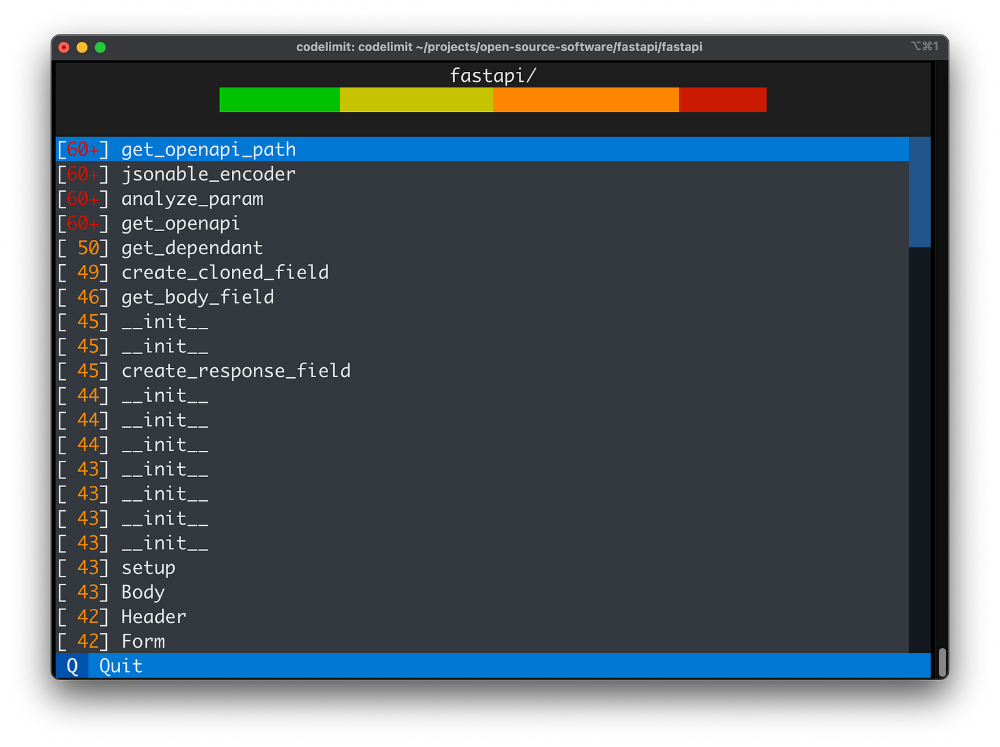

# CodeLimit

Your Refactoring Alarm




[](https://github.com/getcodelimit/codelimit/actions/workflows/ci.yml)
[](https://codecov.io/gh/getcodelimit/codelimit)
[](https://mypy-lang.org/)
[](https://github.com/psf/black)
[](https://github.com/astral-sh/ruff)

# Usage

## Running

After installing depencies with `poetry install`, CodeLimit can be run from the
repository root like this:

```shell
poetry run codelimit
```

For example, to check a codebase at `~/projects/fastapi` run:

```shell
poetry run codelimit ~/projects/fastapi
```

# Development

## Using the Textal debug console

Open a terminal and start the Textual debug console:

```shell
poetry run textual console
```

Next, open another terminal and start Code Limit in development mode:

```shell
poetry run textual run --dev main.py
```

## Building the binary distribution

Generate a self-contained binary:

```shell
./build-dist.sh
```
