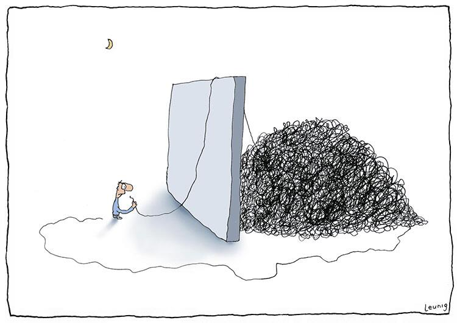

# Introduction

Code Limit is a tool for developers with one goal: _it tells the developer when
it’s time to refactor_.

Code Limit measures the lines of code for each function in your codebase and
assigns each function to a category:

| Easy | Verbose | Hard-to-maintain 🔔 | Unmaintainable 🚨 |
| :---: | :---: | :---: | :---: |
| 1 - 15 lines of code | 16 - 30 lines of code | 31 - 60 lines of code | 60+ lines of code |
|  |  |  |  |

As the table above shows, functions with more than 60 lines of code (comments
and empty lines are not counted) are _unmaintainable_, and _need_ to be
refactored. Functions with more than 30 lines of code run a risk of turning
into unmaintainable functions over time, you should keep an eye on them and
refactor if possible. Functions in the first two categories are fine and don't
need refactoring.

Function length is just one code metric, but it is a very important code
metric. Short functions are easy to understand, easy to test, easy to re-use.
For example, code duplication is another important code metric but duplication
is much easier to prevent and fix if your functions are short.

<figure markdown>
    

        
    <figcaption>Unmaintainable code. Looks easy; should be done in half an hour I reckon <a href="https://twitter.com/KenScambler/status/477322711039893504">[source]</a></figcaption>
    

</figure>

Function length is a simple code metric, so simple you can count it by hand.
It's also a (fairly) non-controversial metric, most developers agree longer
functions are harder to maintain. Also, there's always a refactoring possible
to make functions smaller.

Because function length is such a simple code metric, many code quality tools
measure it. But these tools measure a lot more metrics, sometimes so much
metrics that developers are overwhemled and loose focus on the metrics that
matter most.

Code Limit measures only function length but it tries to be the best developer
tool for measuring it. By notifying developers when it's time to refactor, Code
Limit prevents unmaintainable code.

Keep your software maintainable and start using Code Limit today!
